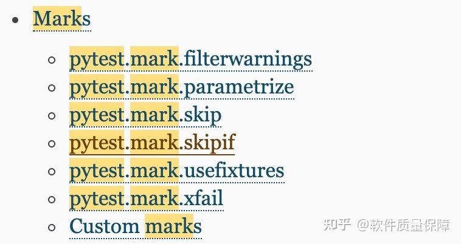

"
    
    本篇主要是mark装饰器中的usefixtures 讲解
"
    

"

    使用心得：

    【一般usefixtures 和 fixture 要「配合」使用的】
    

    1:fixture定义一般都是放在conftest.py文件中，当然也可以放在测试用例模块中】
    2:usefixtures是说明要使用定义的哪个fixture，
      usefixtures可以标注在class上也可以标注在测试用例上面
      依赖于你期望的作用域

   参考：

        https://zhuanlan.zhihu.com/p/382158304
        https://zhuanlan.zhihu.com/p/87775743
        https://mp.weixin.qq.com/s?__biz=MzU3NDM4ODEzMg==&mid=2247490139&idx=1&sn=0dce34456bb7726d9b4d5904a12ea8c2&chksm=fd327890ca45f186d1839716bce950399c8b663ff78deb7cea9f947eabd40353f617a0e3ddb0#rd

  conftest.py 文件
    
       fixture scope 为 session 级别是可以跨 .py 模块调用的，
       也就是当我们有多个 .py 文件的用例时，如果多个用例只需调用一次 fixture，可以将 scope='session'，
       并且写到 conftest.py 文件里。写到 conftest.py 文件可以【全局调用】这里面的方法。
       使用的时候【不需要导入 conftest.py 】这个文件。
       使用 conftest.py 的规则：
    
        1： conftest.py 这个文件名是固定的，不可以更改。

        2： 使用的时候不需要导入 conftest.py，pytest 会自动识别到这个文件
        
        3： 放到项目的根目录下可以全局调用，「放到某个 package 下，就在这个 package 内有效」。
        
        案例
        
            在运行整个项目下的所有的用例，只执行一次打开浏览器。
            
            执行完所有的用例之后再执行关闭浏览器，可以在这个项目下创建一个 conftest.py 文件，
         
            将打开浏览器操作的方法放在这个conftest.py文件里面，并添加一个装饰器 @pytest.fixture(scope="session")，
  
            就能够实现整个项目所有测试用例的浏览器复用

**自动执行 fixture-----参考连接3 进行搜索关键字**
          
    这里不在一一说明

"""
