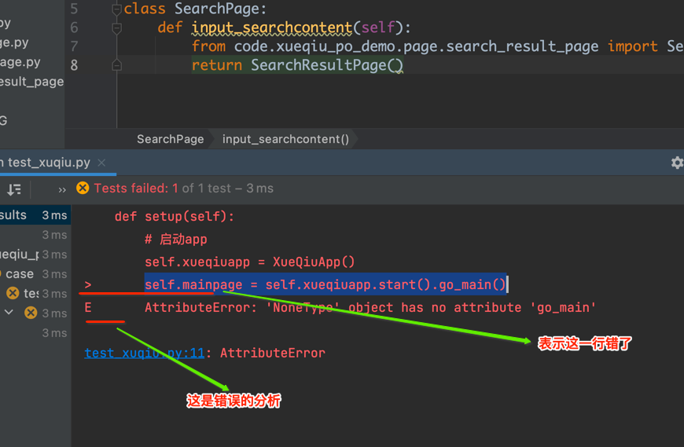
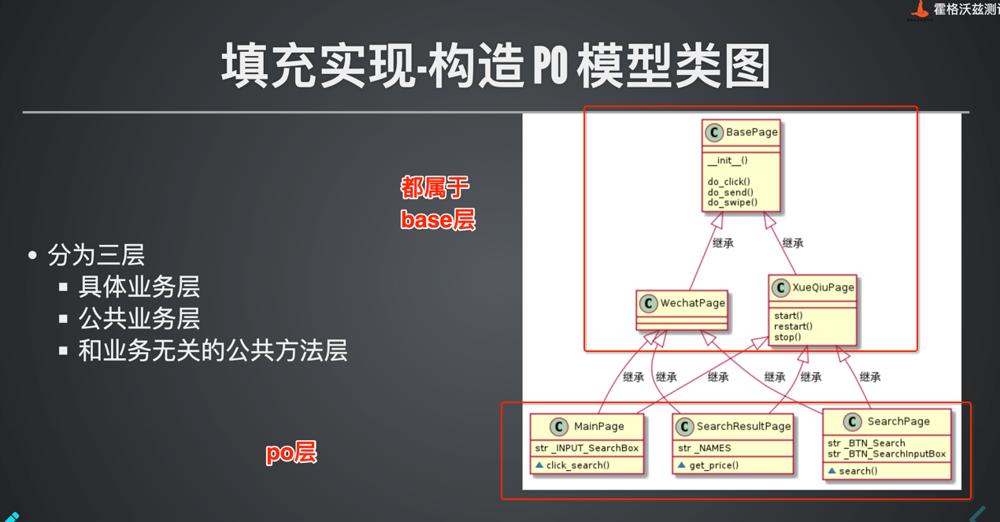
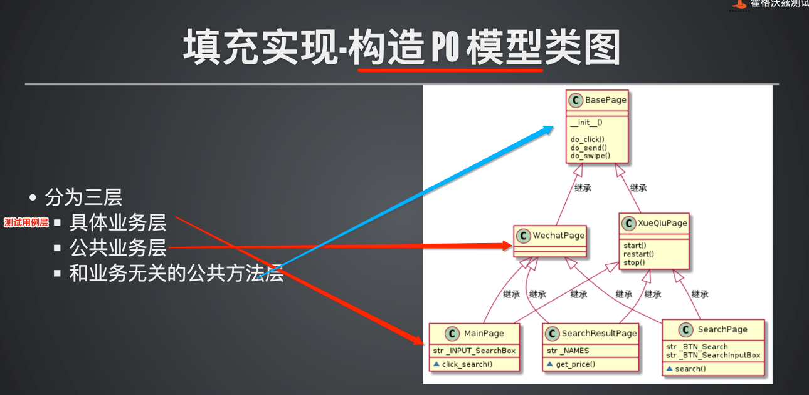
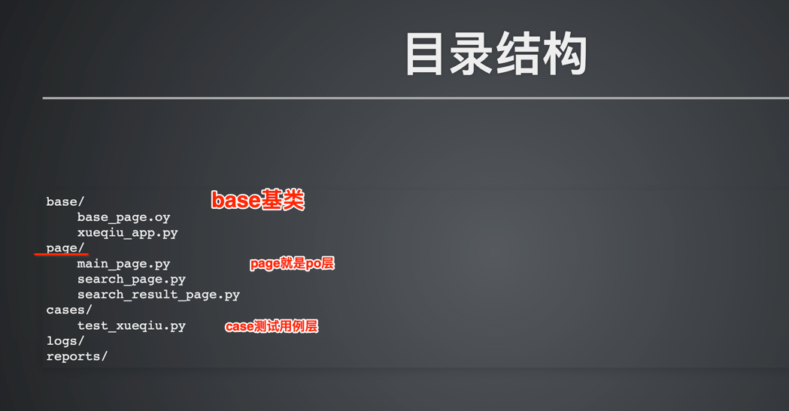

    页面和页面之间的切换 切实也是类和类之间的切换
    通过return来实现

python 日志
    
     有两种方式使用日志
     1：使用python自带的logg
     2：

allure

        生产脚本在pytestini中
        addopts = --capture=no --alluredir ./../report/  --clean-alluredir
        
### report目录下执行
     allure serve report
     会自动打开

数据驱动
    
     1： 准备yaml文件
     2： 定义函数读取yaml文件数据 且 绑定全局变量 【在测试用例模块中】
     3： 被执行的测试用例要添加修饰器， pytest.mark.parametrize
     4： 被执行的测试用例里面的变量 去除，改为参数传递
     ps: parametrize = parame + rize